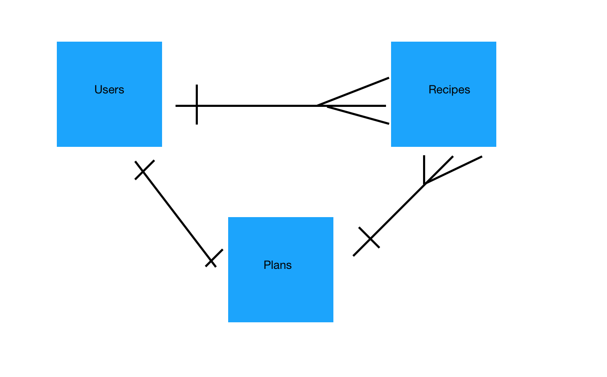

# FoodRun

*Having a plan when running to the store.*

Making food at home saves money, but in order to make sure you use it all up, it
helps to have a plan.

This app, built with a Rails API and a JavaScript front end, is a simple recipe
keeper. With a later update, it will have the ability to produce a grocery list
from the recipes you choose for the week.

## Planning

I initially wanted this app to be complete with a list generator along with check-marking capability on the list. As part of planning the basic requirements of this type of app, I determined the first feature to develop a simple one-to-many data relationship would be a recipe keeper. So I planned to build a working version of this simpler feature, and add to that.

This is my visualization of an Entity Relationship for the app, including later versions' features:

**Later versions**: In order to add another feature, I had to decide the data relationships between the current tables and the new resource. This, at least as a first pass, depends on a choice of functionality: do I want to prioritize users being able to access ingredients from their Recipe table (as in the case of producing a user-owned list of user-created ingredients), or will it be more important to access all Ingredients and all Recipes independent of their ownership (as in a meal planner).
I decided to go with the former approach. After trying an additional table called Plans, I realized I could acheive the desired functionality in a simpler way by eliminating the additional Plans table, and by adding a boolean column to recipes. Then users could mark a recipe as saved and a new view "shopping list" could query the ingredients within marked recipes.

## Link to the front end repo

https://github.com/fritzable/food-run-client

## Link to deployed sites:

Client: https://fritzable.github.io/food-run-client/
API: https://logansfoodrun.herokuapp.com/

## What it does and how it works

Users can sign in and add their own recipes.
Using Rails' authentication methods, all Users are subject to password and username validation before accessing the site's functions.
Signed in Users can retrieve the list of their own recipes, or view a single recipe (currently by ID reference only, updates should include search functionality). Users can update their recipes individually, and they can change their user password.

## Technologies used
- Recipes and any changes are saved as resources to a Postgresql database (Users are, as well).
- Rails backend
- JavaScript: UI and API interaction logic
- HTML: structure
- CSS: styling
- Bootstrap: styling
- Handlebars: HTML templating
Styling credit: On recipe cards, used Benny Bottema's text height calculations and linear-gradient idea to create an underline on each line in an area: https://stackoverflow.com/a/48840828

## Later version enhancements

This app led to several ideas about other cooking-related pain points, and a few of them could be incorporated into later versions of FoodRun.

Optimize step-by-step instruction reading for small devices:
I would say recipe instructions have yet to be optimized on any digital platform, whether laptop or mobile. There is an opportunity to make cooking apps more useful. Steps should be large and readable, and easy to step through. I see this as being an extra large "current" step, with smaller "prior" and "next" steps rotating positions with "current."

UI improvements:
- add Update and Save buttons to recipe cards, and change all buttons to icons.
- collapse forms into their own links inside a hamburger in the navbar.
- improve responsive styling.
- there is a column for image URL in Recipes, but the display image still needs to be coded in.
<!--
# Getting Started

Most importantly, remember to **go slowly and be methodical**. That means you
should be testing your changes in-browser as you write each line or so of code.
Always be commiting. Deploy early and often.

Here's a rough sketch of what you should do and in what order:

### Planning
1.  [x] Review [full-stack-project-practice](https://git.generalassemb.ly/ga-wdi-boston/full-stack-project-practice)
1.  [x] Review [full-stack-project-modeling-lab](https://git.generalassemb.ly/ga-wdi-boston/full-stack-project-modeling-lab)
1.  [x] Create User Stories
1.  [x] Create Wire Frames
1.  [x] Create ERD

### Set Up

API

1.  [x] [Download Rails API Template](https://git.generalassemb.ly/ga-wdi-boston/rails-api-template)
1.  [x] Create a Github Repository
1.  [x] [Deploy to Heroku](https://git.generalassemb.ly/ga-wdi-boston/rails-heroku-setup-guide)

Client

1.  [x] [Download Browser Template](https://git.generalassemb.ly/ga-wdi-boston/browser-template)
1.  [x] Create a Github Repository
1.  [x] [Deploy to Github Pages](https://git.generalassemb.ly/ga-wdi-boston/gh-pages-deployment-guide)

### API
1.  [R] Review [rails-api-one-to-many](https://git.generalassemb.ly/ga-wdi-boston/rails-api-one-to-many) or [rails-api-many-to-many](https://git.generalassemb.ly/ga-wdi-boston/rails-api-many-to-many)
1.  [R] Scaffold your resource
1.  [R] Test your resource's end points with curl scripts
1.  [R] Update resource controller to inherit from Protected or OpenRead controller
1.  [R] Test your resource's end points with curl scripts
1.  [R] Add the relationship to a User
1.  [R] Add User ownership to resource controller (current_user)

### Client
1.  [x] Review [api-token-auth](https://git.generalassemb.ly/ga-wdi-boston/api-token-auth)
1.  [x] Sign Up (curl then web app)
1.  [x] Sign In (curl then web app)
1.  [x] Change Password (curl then web app)
1.  [x] Sign Out (curl then web page)
1.  [x] All API calls have success or failure messages
1.  [x] Review [query-ajax-post](https://github.com/ga-wdi-boston/jquery-ajax-post)
1.  [x] Create resource (curl then web app)
1.  [x] Get all of their owned resources (curl then web app)
1.  [x] Delete single resource (curl then web app)
1.  [x] Update single resource (curl then web app)

### Final Touches
1.  [x] Review Handlebars
1.  [x] Handlebars template for displaying recipes
1.  [x] Model styles for navbar and footer
1.  [o] Add classes and styles to achieve model
1.  [o] Add Edit button to template
1.  [o] Change template buttons to icons: trash, pencil, plus
2.  [x] Troubleshoot/Debug
3.  [x] Style -->
